# Sakura Line

A bspwm rice for Arch Linux where everything - bar, menus, popups,
notifications, lock screen, terminal and prompt - is drawn from one palette and
one set of shapes, so it feels like one system instead of a pile of tools.

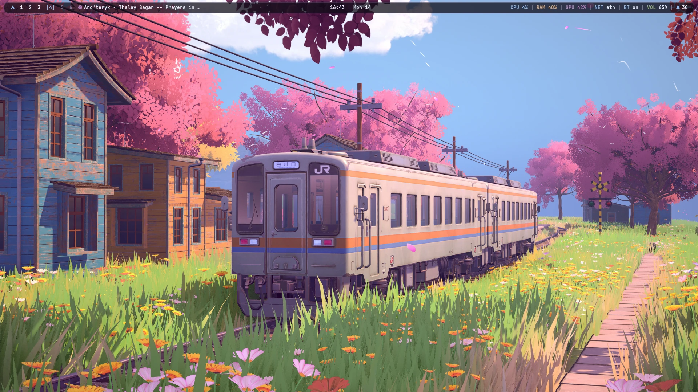

## Screenshot Gallery

A unified design language across window borders, bar, popups, and menus. See the **[Full Gallery & Feature Walkthrough](docs/GALLERY.md)** for detailed full-screen previews.

### Built-in Themes

Switch themes on the fly with `super + shift + t` (or `rice-theme select`). The entire system adapts immediately: wallpaper, Polybar, Dunst notifications, Eww panels, Rofi menus, terminals, and btop.

| Sakura Line | Pirna (Classic Art) |
|:---:|:---:|
| [](docs/GALLERY.md#1-sakura-line) | [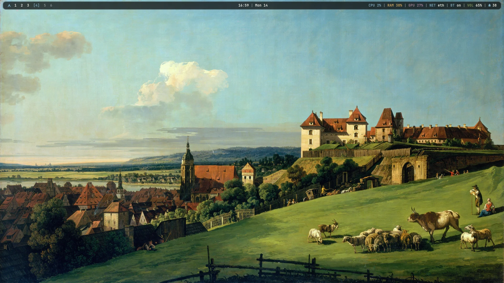](docs/GALLERY.md#2-pirna) |
| **Nordic Frost** | **Monolith** |
| [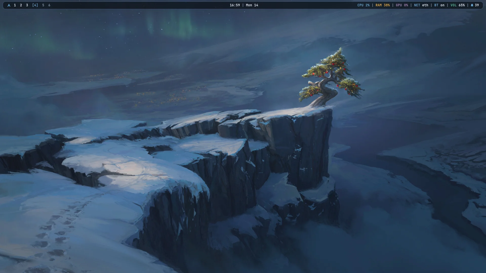](docs/GALLERY.md#3-nordic-frost) | [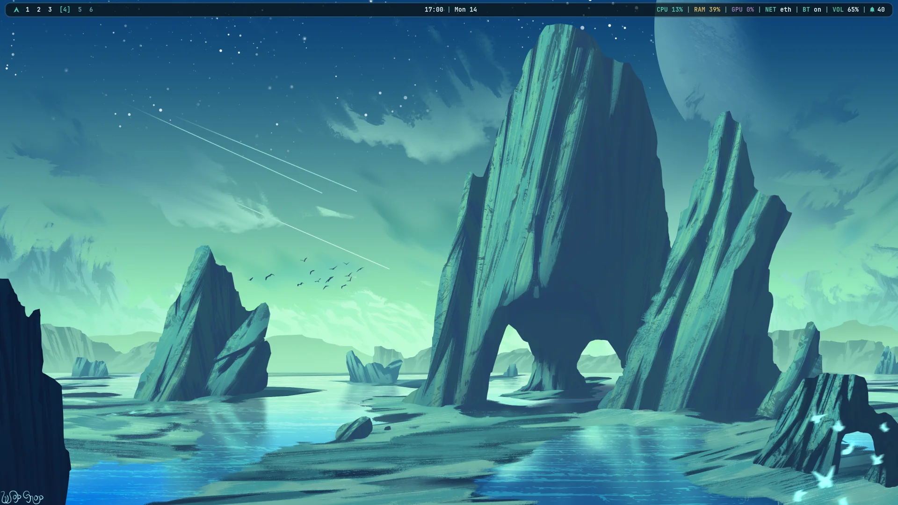](docs/GALLERY.md#4-monolith) |
| **Dragon Fire** | **Visual Theme Selector** |
| [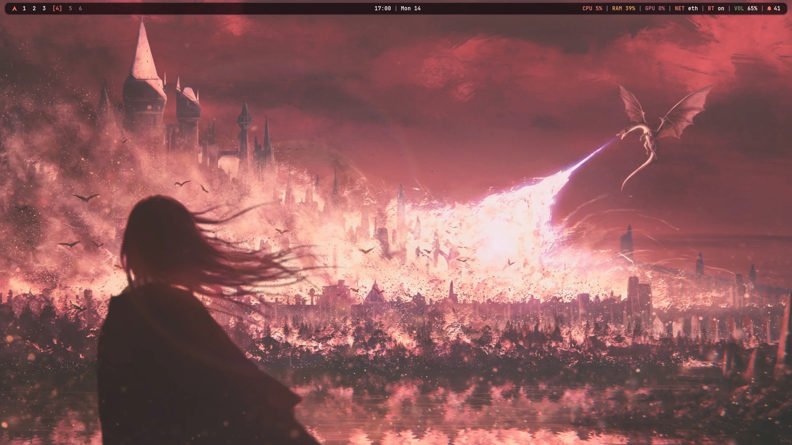](docs/GALLERY.md#5-dragon-fire) | [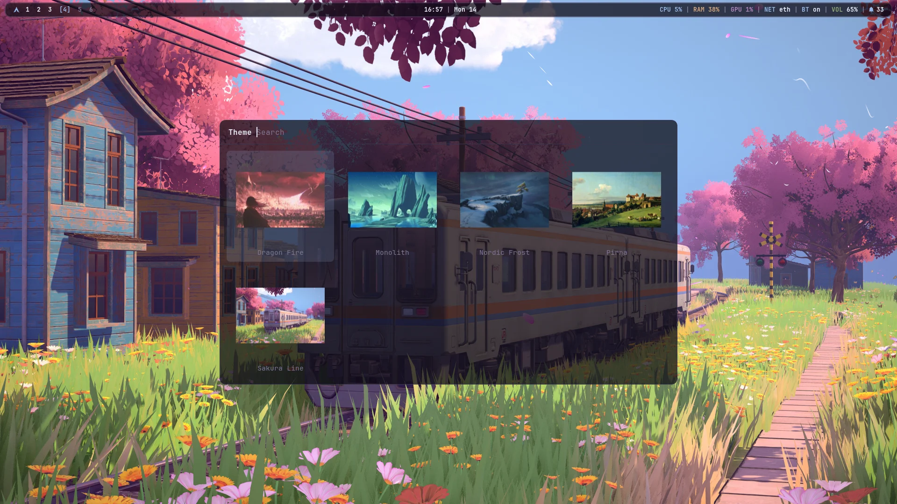](docs/GALLERY.md#6-visual-theme-selector) |

### Workspaces & Window Management

| Clean Desktop | Tiling Layout |
|:---:|:---:|
| [](docs/GALLERY.md#clean-desktop) | [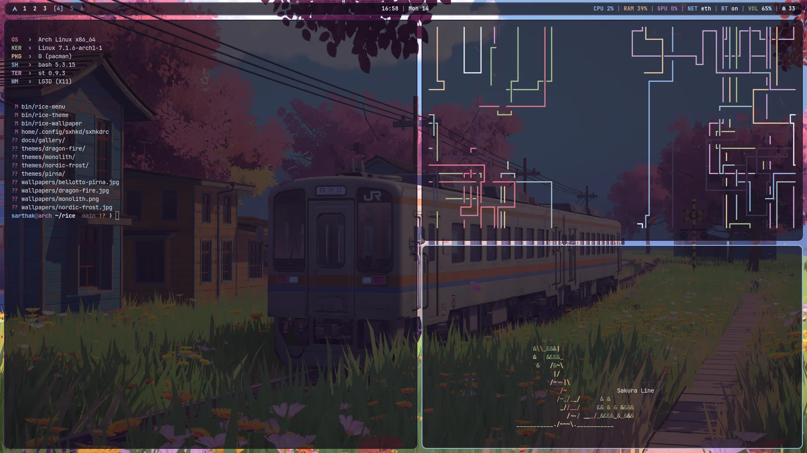](docs/GALLERY.md#window-tiling) |
| *Floating rounded Polybar with workspace dots and system telemetry* | *bspwm automatic balanced tiling with dynamic window gaps* |

| Centered Terminal | Drop-Down Scratchpad |
|:---:|:---:|
| [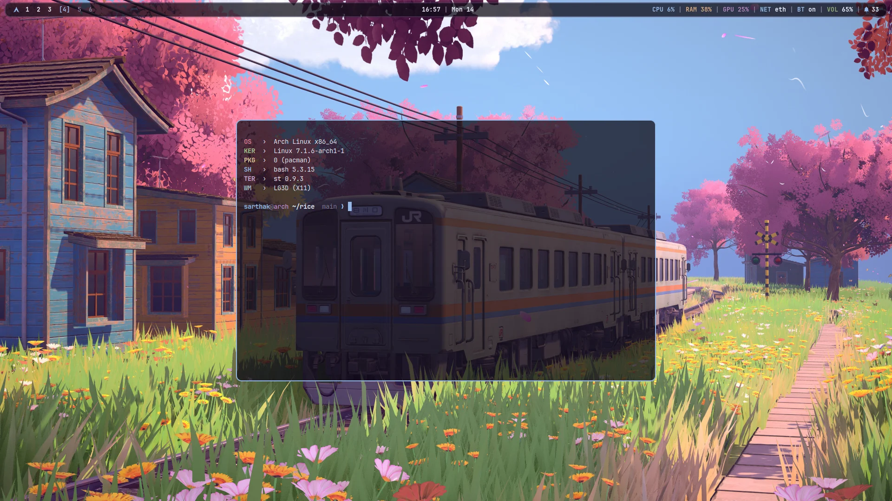](docs/GALLERY.md#floating-terminal) | [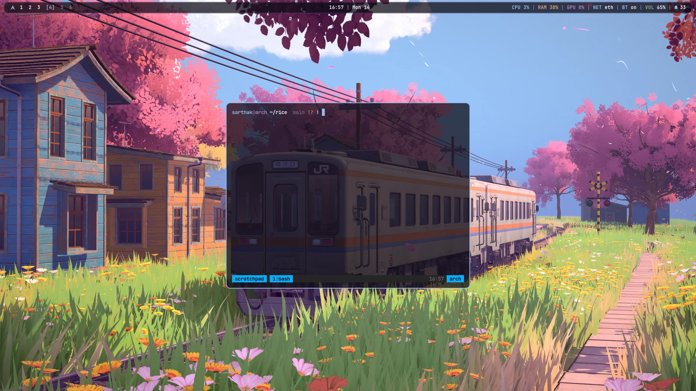](docs/GALLERY.md#drop-down-scratchpad) |
| *st with sixel support, fastfetch and Starship prompt* | *Quick-access persistent drop-down terminal (`super + \``)* |

### Panels & Control Popups

| Control Centre | Audio Mixer |
|:---:|:---:|
| [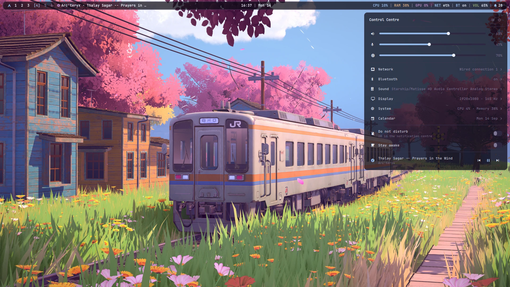](docs/GALLERY.md#control-centre-super--a) | [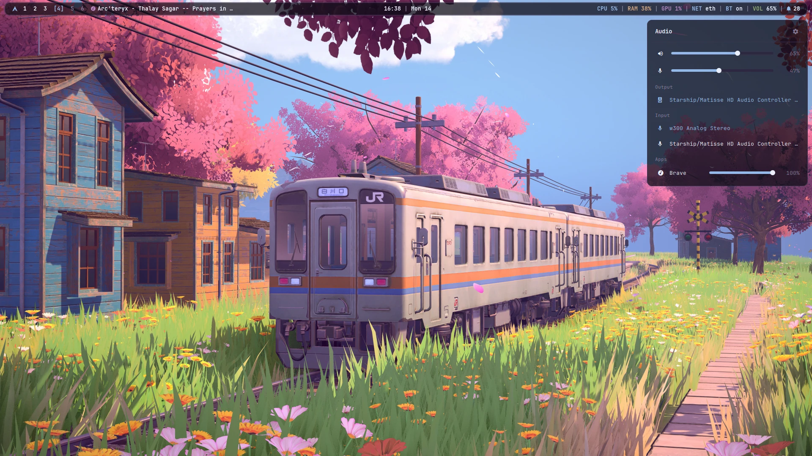](docs/GALLERY.md#audio-mixer-super--ctrl--a) |
| *Sliders for volume, mic, brightness; quick toggles (`super + a`)* | *Per-application mixer and sink selectors (`super + ctrl + a`)* |

| Calendar & Events | Media Player |
|:---:|:---:|
| [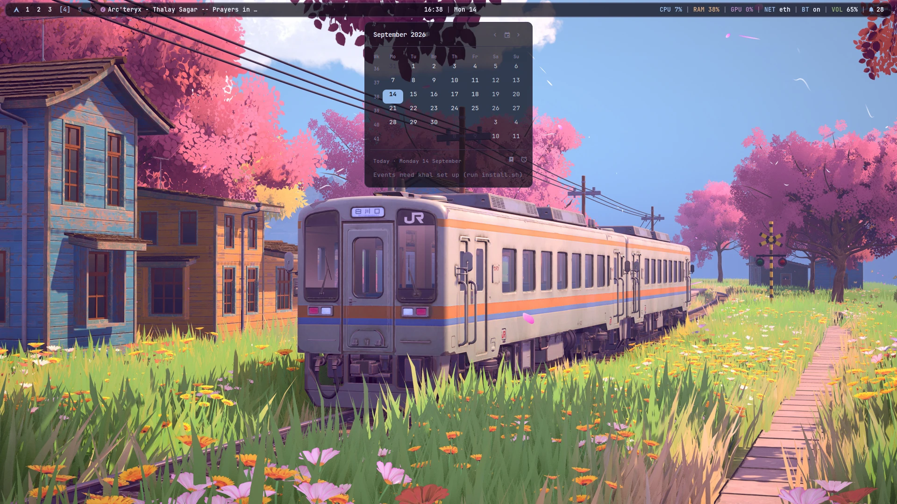](docs/GALLERY.md#calendar--reminders-super--ctrl--c) | [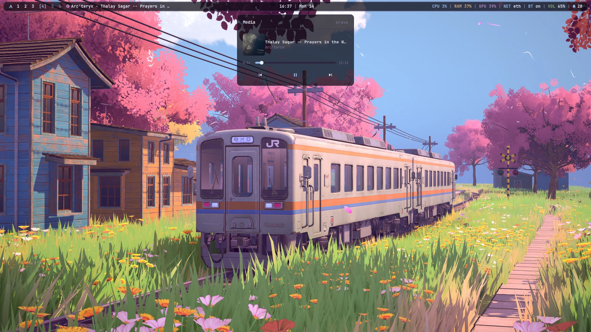](docs/GALLERY.md#media-player-super--ctrl--m) |
| *CalDAV synchronized calendar & reminders (`super + ctrl + c`)* | *Track metadata, cover art and media controls (`super + ctrl + m`)* |

### Menus & Launchers

| Rofi Rice Menu | Keybindings Cheatsheet |
|:---:|:---:|
| [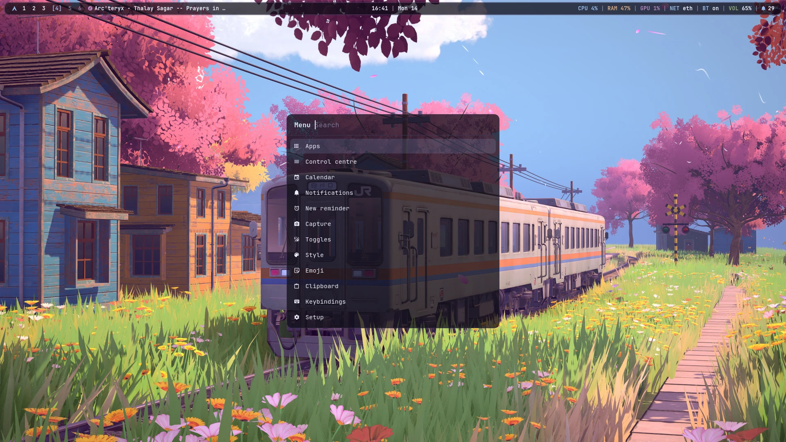](docs/GALLERY.md#rice-launcher-menu-super--m) | [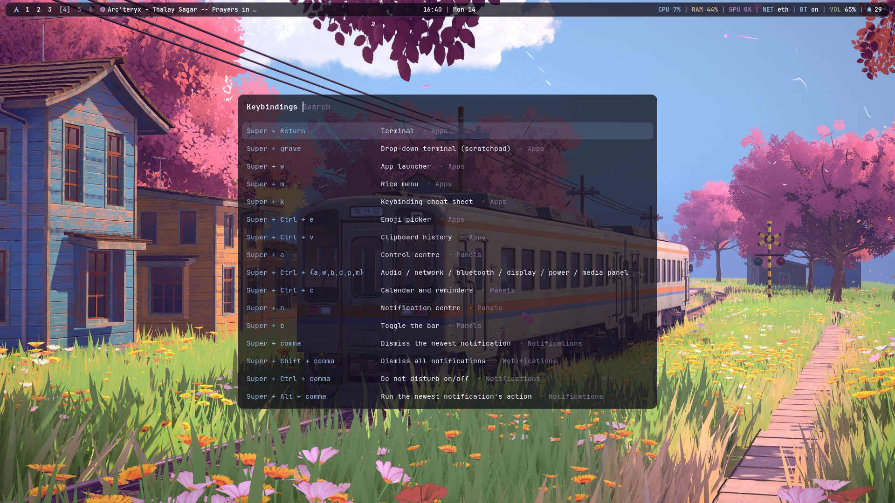](docs/GALLERY.md#keybinding-cheatsheet-super--k) |
| *Unified system menu & launcher (`super + m`)* | *Searchable hotkey cheatsheet (`super + k`)* |

| Wallpaper Picker | Styled Notifications |
|:---:|:---:|
| [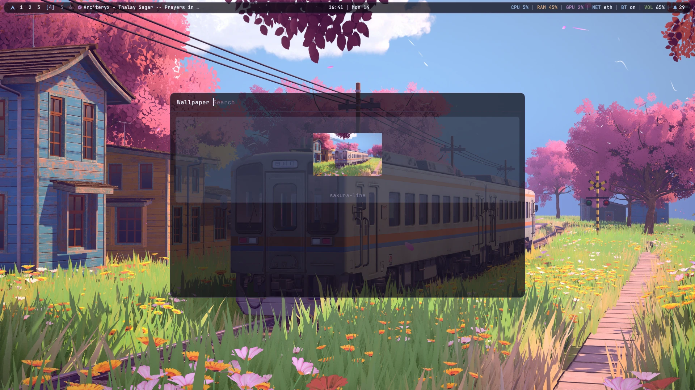](docs/GALLERY.md#wallpaper-picker-super--ctrl--space) | [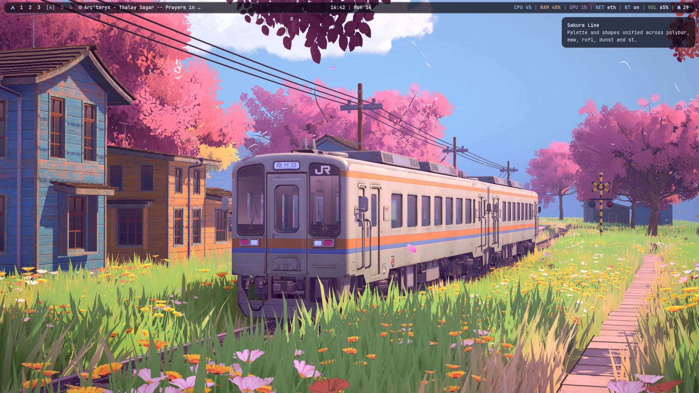](docs/GALLERY.md#toast-notifications) |
| *Visual thumbnail grid picker (`super + ctrl + space`)* | *Dunst notification toasts rendered from the active palette* |

## Install

On a clean Arch install, as your normal user:

```sh
curl -fsSL https://rice.srtk.in/install.sh | bash
```

or from a clone:

```sh
git clone https://github.com/sarthak1337-alt/dotfiles.git ~/rice
# or self-hosted: git clone https://git.srtk.in/sarthak/dotfiles.git ~/rice
~/rice/install.sh              # full install, safe to re-run
~/rice/install.sh --dry-run    # print every step, change nothing
~/rice/install.sh --update     # pull, re-link, re-render, rebuild what changed
```

The installer installs the packages (bootstrapping paru for the AUR), symlinks
every file in `home/` into `$HOME` and every script in `bin/` into
`~/.local/bin`, renders the theme, builds st with sixel images, and offers
calendar sync and a stock Plymouth boot splash. Anything it replaces is moved
to `~/.rice-backup-<date>/`. Log in on tty1 and the desktop starts.

## What you get

| | |
|---|---|
| Window manager | bspwm + sxhkd |
| Bar | polybar, floating and rounded; every label opens its panel |
| Popups | eww: control centre, audio, network, bluetooth, display, power, media, calendar, notifications |
| Menus | rofi: launcher, rice menu, power, toggles, capture, theme and wallpaper pickers, emoji, clipboard, keybindings |
| Notifications | dunst, with a notification centre, per-notification dismiss and do-not-disturb |
| Compositor | picom 13, one motion language for windows and popups |
| Terminal | st (st-flexipatch with sixel, ligatures, scrollback) and kitty |
| Prompt | starship, one line: `user@host dir branch ❯` |
| Idle | xscreensaver hacks after 5 minutes, xsecurelock after 10, skipped during fullscreen video |
| Calendar | khal + vdirsyncer against any CalDAV server; reminders as systemd timers |
| Capture | flameshot, gpu-screen-recorder, OCR, QR codes, colour picker, webcam overlay, transcode |

`super + k` lists every shortcut. The ones to learn first:

| | |
|---|---|
| `super + Return` | terminal |
| `super + w` / `super + m` | app launcher / rice menu |
| `super + a` / `super + n` | control centre / notification centre |
| `super + ctrl + a / w / b / d / p / m` | audio / network / bluetooth / display / power / media |
| `super + ctrl + c` | calendar |
| `super + ctrl + r` | new reminder ("20m tea", "15:30 standup") |
| `super + c` / `super + v` | copy / paste, terminals included |
| `super + ctrl + v` / `super + ctrl + e` | clipboard history / emoji |
| `Print` or `super + alt + p` | screenshot a region |
| `shift + Print` or `super + alt + shift + p` | screenshot the whole screen |
| `ctrl + Print` or `super + alt + t` | copy text from a region |
| `alt + Print` or `super + alt + v` | start or stop recording |
| `super + shift + Print` or `super + alt + c` | pick a colour |
| `super + Print` or `super + alt + s` | capture menu |
| `` super + ` `` | drop-down terminal |
| `super + shift + t` / `super + ctrl + space` | theme picker / wallpaper picker |
| `super + Escape` / `super + ctrl + l` | power menu / lock |

## Theming

A theme is one file, `themes/<name>/colors.toml` (and optional custom assets like `btop.theme`). `rice-theme set <name>` renders every file in `templates/` from it into `~/.local/state/rice/theme/` and reloads all running apps and wallpapers in lockstep.

The rice ships with 5 built-in themes sampled from distinct visual worlds:
- **`sakura-line`**: Japanese spring anime aesthetic (pastel cherry blossom, blue sky, soft lilac)
- **`pirna`**: Classical 1750s European oil painting by Bernardo Bellotto (terracotta roofs, sandstone fortress, olive meadows, river cerulean)
- **`nordic-frost`**: Arctic snowy mountain cliff under the aurora borealis (polar midnight darks, amber lanterns, mint sky glow)
- **`monolith`**: Extraterrestrial sci-fi coast (crystalline cyan rock, bioluminescent lagoon water, celestial moonlit sky)
- **`dragon-fire`**: Dark fantasy epic siege (fiery dragonflame breath, blazing coral embers, smoky obsidian plum darks)

### Managing Themes
- **Visual Picker**: Press `super + shift + t` or run `rice-theme select` for the Rofi image grid.
- **Set via CLI**: `rice-theme set <name>`
- **List available**: `rice-theme list`
- **Re-render active**: `rice-theme reload`

### Adding Your Own Themes
1. Create a directory `themes/<name>/` (in the repo or in `~/.config/rice/themes/<name>/`).
2. Put your wallpaper in `wallpapers/<image>` (or reference an image path).
3. Create `colors.toml` following the schema in `themes/sakura-line/colors.toml`.
4. Run `rice-theme set <name>` or open the visual picker (`super + shift + t`) - your theme will appear immediately with automatic cached thumbnails!

- `~/.config/rice/theme.override.toml` wins over every theme (`rice-font` writes the font there).
- Your own templates go in `~/.config/rice/templates/*.tpl` and win over the built-in ones.

Placeholders are `{{ key }}`, `{{ key_strip }}` (no `#`) and `{{ key_rgb }}` (`r,g,b`).

## Your own settings

These are never in the repo and never overwritten:

| | |
|---|---|
| `~/.bashrc.local` | personal aliases, exports, SDK paths |
| `~/.config/rice/local.sh` | autostarted apps, per-app desktops, monitor tweaks (sourced by bspwmrc) |
| `~/.config/rice/idle.conf` | `SCREENSAVER=` and `LOCK=` in seconds |
| `~/.config/rice/screensavers` | the xscreensaver hacks to rotate through |
| `~/.config/rice/hooks/<event>.d/` | scripts run on `post-boot`, `theme-set`, `font-set`, `wallpaper-set`, `lock`, `unlock`, `update` |
| `~/.config/rice/secrets/` | the CalDAV password (mode 600) |

## Layout

```
install.sh        one-shot installer
packages/         pacman.txt and aur.txt
bin/              rice-* scripts: panels' data and actions, menus, capture, idle, theme
home/             files linked into $HOME
templates/        *.tpl rendered from a theme's colors.toml
themes/           one directory per theme
st/               st-flexipatch patch list, config changes and build script
particles/        the particle wallpaper layer
wallpapers/
```
