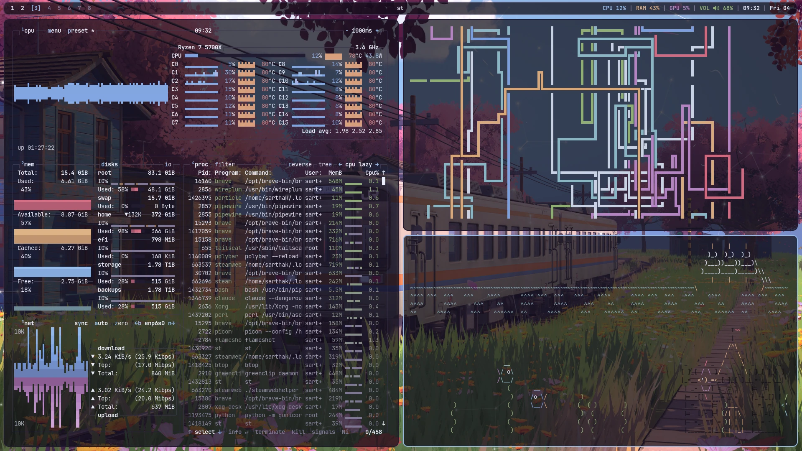

# Sakura Line

A bspwm rice for Arch Linux where everything - bar, menus, popups,
notifications, lock screen, terminal and prompt - is drawn from one palette and
one set of shapes, so it feels like one system instead of a pile of tools.



## Install

On a clean Arch install, as your normal user:

```sh
curl -fsSL https://rice.srtk.in/install.sh | bash
```

or from a clone:

```sh
git clone https://git.srtk.in/sarthak/dotfiles.git ~/rice
~/rice/install.sh              # full install, safe to re-run
~/rice/install.sh --dry-run    # print every step, change nothing
~/rice/install.sh --update     # pull, re-link, re-render, rebuild what changed
```

The installer installs the packages (bootstrapping paru for the AUR), symlinks
every file in `home/` into `$HOME` and every script in `bin/` into
`~/.local/bin`, renders the theme, builds st with sixel images, and offers
calendar sync and a stock Plymouth boot splash. Anything it replaces is moved
to `~/.rice-backup-<date>/`. Log in on tty1 and the desktop starts.

## What you get

| | |
|---|---|
| Window manager | bspwm + sxhkd |
| Bar | polybar, floating and rounded; every label opens its panel |
| Popups | eww: control centre, audio, network, bluetooth, display, power, media, calendar, notifications |
| Menus | rofi: launcher, rice menu, power, toggles, capture, theme and wallpaper pickers, emoji, clipboard, keybindings |
| Notifications | dunst, with a notification centre, per-notification dismiss and do-not-disturb |
| Compositor | picom 13, one motion language for windows and popups |
| Terminal | st (st-flexipatch with sixel, ligatures, scrollback) and kitty |
| Prompt | starship, one line: `user@host dir branch ❯` |
| Idle | xscreensaver hacks after 5 minutes, xsecurelock after 10, skipped during fullscreen video |
| Calendar | khal + vdirsyncer against any CalDAV server; reminders as systemd timers |
| Capture | flameshot, gpu-screen-recorder, OCR, QR codes, colour picker, webcam overlay, transcode |

`super + k` lists every shortcut. The ones to learn first:

| | |
|---|---|
| `super + Return` | terminal |
| `super + w` / `super + m` | app launcher / rice menu |
| `super + a` / `super + n` | control centre / notification centre |
| `super + ctrl + a / w / b / d / p / m` | audio / network / bluetooth / display / power / media |
| `super + ctrl + c` | calendar |
| `super + ctrl + r` | new reminder ("20m tea", "15:30 standup") |
| `super + c` / `super + v` | copy / paste, terminals included |
| `super + ctrl + v` / `super + ctrl + e` | clipboard history / emoji |
| `Print` or `super + alt + p` | screenshot a region |
| `shift + Print` or `super + alt + shift + p` | screenshot the whole screen |
| `ctrl + Print` or `super + alt + t` | copy text from a region |
| `alt + Print` or `super + alt + v` | start or stop recording |
| `super + shift + Print` or `super + alt + c` | pick a colour |
| `super + Print` or `super + alt + s` | capture menu |
| `` super + ` `` | drop-down terminal |
| `super + Escape` / `super + ctrl + l` | power menu / lock |

## Theming

A theme is one file, `themes/<name>/colors.toml`. `rice-theme set <name>`
renders every file in `templates/` from it into `~/.local/state/rice/theme/`
and reloads the running apps; configs include or link those rendered files.

- Your own themes go in `~/.config/rice/themes/<name>/`.
- `~/.config/rice/theme.override.toml` wins over every theme (`rice-font` writes the font there).
- Your own templates go in `~/.config/rice/templates/*.tpl` and win over the built-in ones.

Placeholders are `{{ key }}`, `{{ key_strip }}` (no `#`) and `{{ key_rgb }}` (`r,g,b`).

## Your own settings

These are never in the repo and never overwritten:

| | |
|---|---|
| `~/.bashrc.local` | personal aliases, exports, SDK paths |
| `~/.config/rice/local.sh` | autostarted apps, per-app desktops, monitor tweaks (sourced by bspwmrc) |
| `~/.config/rice/idle.conf` | `SCREENSAVER=` and `LOCK=` in seconds |
| `~/.config/rice/screensavers` | the xscreensaver hacks to rotate through |
| `~/.config/rice/hooks/<event>.d/` | scripts run on `post-boot`, `theme-set`, `font-set`, `wallpaper-set`, `lock`, `unlock`, `update` |
| `~/.config/rice/secrets/` | the CalDAV password (mode 600) |

## Layout

```
install.sh        one-shot installer
packages/         pacman.txt and aur.txt
bin/              rice-* scripts: panels' data and actions, menus, capture, idle, theme
home/             files linked into $HOME
templates/        *.tpl rendered from a theme's colors.toml
themes/           one directory per theme
st/               st-flexipatch patch list, config changes and build script
particles/        the particle wallpaper layer
wallpapers/
```
